# Personal Finance Companion - Architecture Documentation

## About This Project

This project was built using modern AI-assisted development methodologies:

- **OpenCode with SpecKit**: Used for feature specification, planning, and task management. SpecKit provided structured workflows for requirement analysis, implementation planning, and progress tracking throughout the development lifecycle.

- **Google Stitch MCP**: Employed for UI/UX design generation, creating a consistent and professional design system with reusable components tailored for mobile platforms.

- **LLM Models**:
  - **MiniMax M2.5**: Primary model used for code generation, problem-solving, and implementation guidance
  - **ChatGPT**: Assisted with initial project planning and architecture design

This approach enabled efficient development with clear documentation, structured planning, and consistent quality across all features.

---

## Screenshots

### Authentication
| | |
|---|---|
|  | 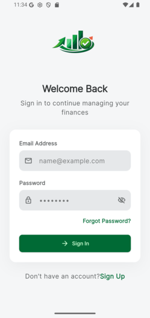 |
| Splash Screen | Login Screen |
| 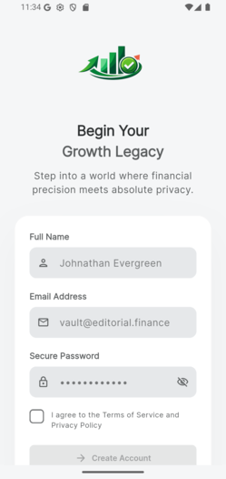 | 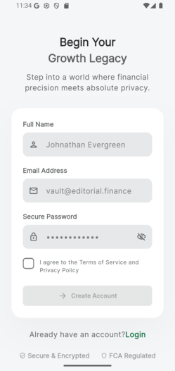 |
| Register Step 1 | Register Step 2 |
| 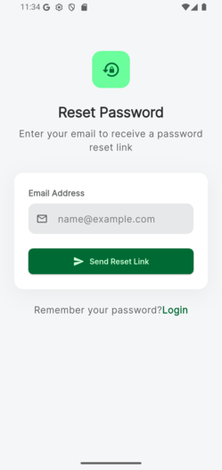 | |
| Forgot Password | |

### Dashboard
| | |
|---|---|
| 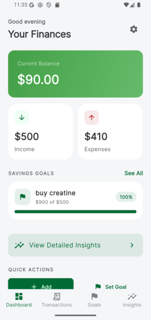 | 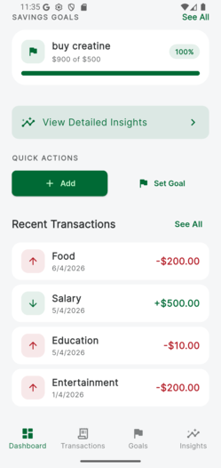 |
| Dashboard (Light) | Dashboard Overview (Light) |
| 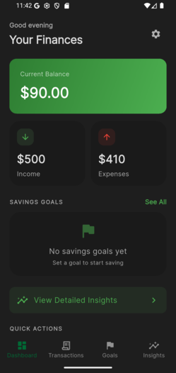 | 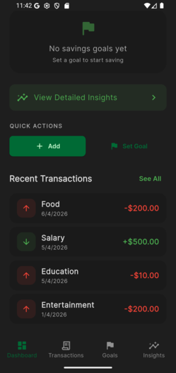 |
| Dashboard (Dark) | Dashboard Overview (Dark) |

### Transactions
| | |
|---|---|
| 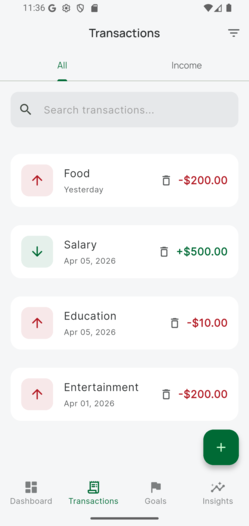 | 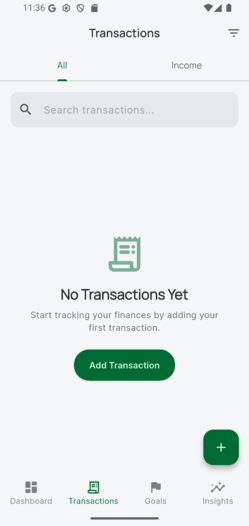 |
| Transactions List | Transactions Empty State |
| 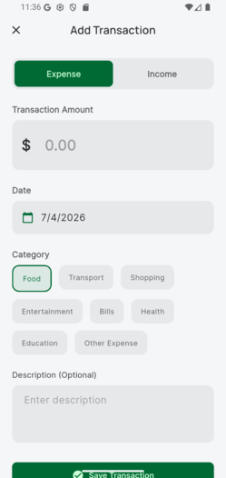 | 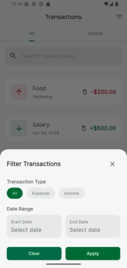 |
| Add Transaction | Transaction Filter |
|  | 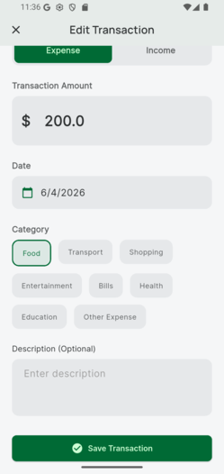 |
| Edit Transaction | Edit Transaction Details |
| 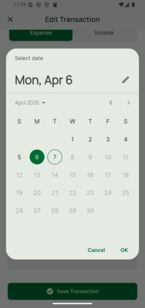 | |
| Date Picker | |

### Savings Goals
| | |
|---|---|
| 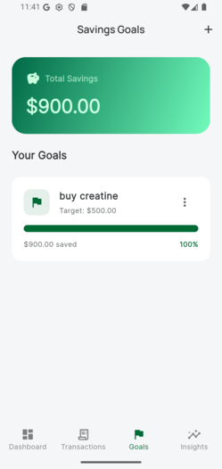 | 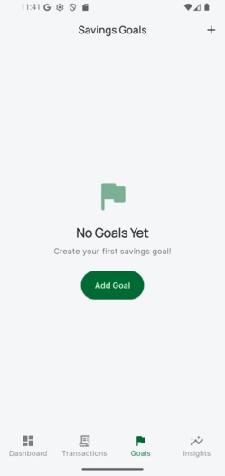 |
| Savings Goals | Savings Goals Empty State |
| 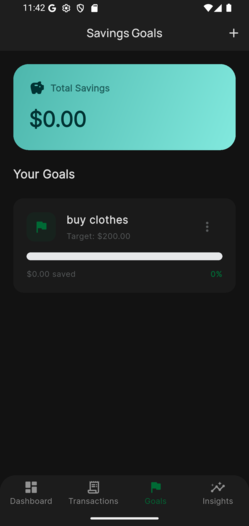 | 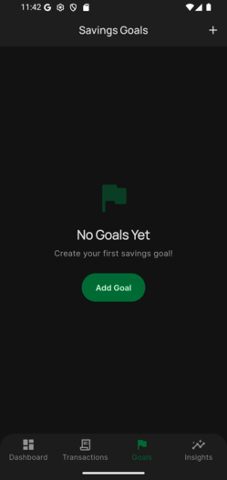 |
| Savings Goals (Dark) | Savings Goals Empty (Dark) |
| 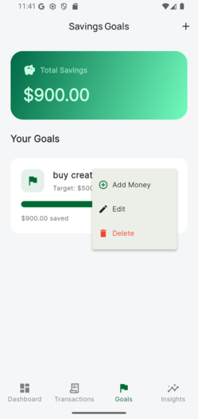 | 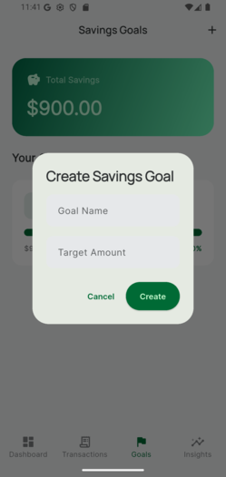 |
| Goal Options | Create Goal Dialog |

### Insights
| | |
|---|---|
| 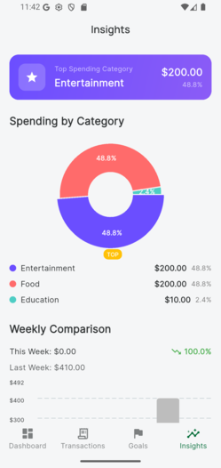 | 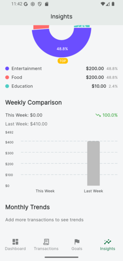 |
| Insights (Light) | Insights Charts (Light) |
| 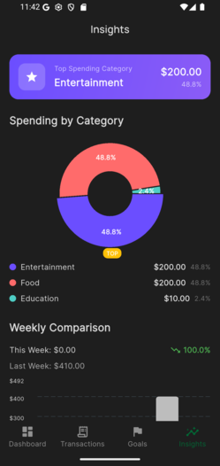 | 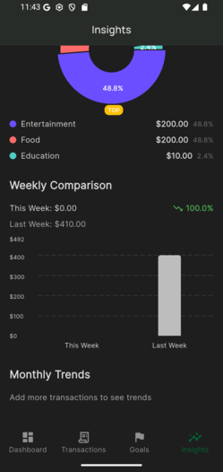 |
| Insights (Dark) | Insights Charts (Dark) |

### Settings
| | |
|---|---|
| 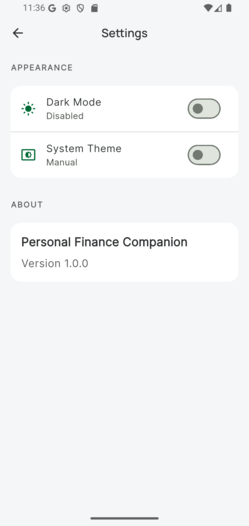 | 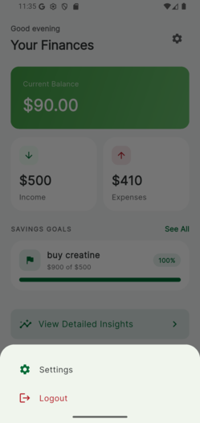 |
| Settings (Light) | Settings Bottom Sheet |
| 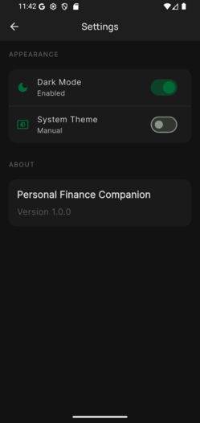 | |
| Settings (Dark) | |

---

## Project Structure

This project follows a **Feature-based + Clean Architecture** pattern.

```
lib/
├── main.dart                    # App entry point
├── app.dart                     # App configuration with routing
├── core/                        # Core utilities and services
│   ├── config/                  # Environment configuration
│   │   └── environment.dart     # Environment enum and settings
│   ├── constants/               # App-wide constants
│   │   └── app_constants.dart   # Transaction categories, etc.
│   ├── cubits/                  # Global Cubit utilities
│   │   └── app_cubit_observer.dart
│   ├── services/                # Core services
│   │   ├── supabase_service.dart
│   │   └── dependency_injection.dart
│   ├── theme/                   # Theme configuration
│   │   ├── app_theme.dart
│   │   ├── app_colors.dart
│   │   └── app_typography.dart
│   └── utils/                   # Utility helpers
│       └── date_utils.dart
├── features/                    # Feature modules
│   ├── auth/
│   │   ├── data/                # Repositories, data sources
│   │   ├── domain/             # Entities, use cases
│   │   └── presentation/       # Screens, widgets, cubits
│   ├── transactions/
│   │   ├── data/
│   │   ├── domain/
│   │   └── presentation/
│   ├── dashboard/
│   │   ├── data/
│   │   ├── domain/
│   │   └── presentation/
│   ├── goals/
│   │   ├── data/
│   │   ├── domain/
│   │   └── presentation/
│   └── insights/
│       ├── data/
│       ├── domain/
│       └── presentation/
├── routes/                      # Routing configuration
│   ├── app_router.dart         # GoRouter configuration
│   └── route_names.dart        # Route name constants
└── shared/                      # Shared utilities
    ├── models/                  # Reusable models
    └── widgets/                 # Reusable widgets
```

## Architecture Principles

### 1. Feature-Based Organization
- Each feature (auth, transactions, dashboard, goals, insights) has its own folder
- Features are independent and can be developed in parallel

### 2. Clean Architecture Layers
Each feature follows:
- **data/**: Repositories, data sources, API clients
- **domain/**: Entities, use cases, business logic
- **presentation/**: UI screens, widgets, Cubits (state management)

### 3. State Management
- Uses **Cubit** pattern from flutter_bloc
- One Cubit per feature
- States are Equatable for efficient rebuilds

### 4. Dependency Injection
- Uses **get_it** for service locator
- All services are registered in `dependency_injection.dart`

### 5. Routing
- Uses **go_router** for declarative routing
- Route names defined in `route_names.dart`

## Core Services

### Supabase Service
- Handles Supabase client initialization
- Provides authentication methods
- Manages database connections

### Environment Configuration
- Supports dev, staging, prod environments
- Configurable Supabase URL and anon key
- Debug mode toggle

## Theme System

- Uses Material Design 3
- Light and dark theme support
- Custom colors, typography defined in core/theme/

## Naming Conventions

- **Files**: snake_case (e.g., `auth_cubit.dart`)
- **Classes**: PascalCase (e.g., `AuthCubit`)
- **Constants**: PascalCase with prefix (e.g., `AppConstants`)
- **Routes**: camelCase route names in `route_names.dart`

## Development Workflow

1. **Create feature folder**: Add new feature under `lib/features/`
2. **Implement layers**: Add data, domain, presentation subfolders
3. **Create Cubit**: Add state and cubit classes for state management
4. **Register services**: Add any new services to dependency_injection.dart
5. **Add routes**: Register new screens in app_router.dart

## Testing

- Unit tests: `test/unit/`
- Widget tests: `test/widget/`
- Integration tests: `test/integration/`

## Prerequisites

Before running the app, ensure you have:

- **Flutter SDK 3.x+**: [Install Flutter](https://flutter.dev/docs/get-started/install)
- **Dart 3.x+**: Comes with Flutter
- **Supabase Account**: Create a free project at [supabase.com](https://supabase.com)
- **Code Editor**: VS Code or Android Studio recommended

---

## Installation

1. **Clone the repository**:
   ```bash
   git clone <repository-url>
   cd personal_finance_companion_mobile_app
   ```

2. **Install dependencies**:
   ```bash
   flutter pub get
   ```

3. **Configure Supabase**:
   - Create a project at [supabase.com](https://supabase.com)
   - Get your project URL and anon key from Settings → API
   - Create a `.env` file in the project root:
     ```
     SUPABASE_URL=your_project_url
     SUPABASE_ANON_KEY=your_anon_key
     ```
   - Copy `.env.example` to `.env` if available

4. **Set up Database**:
   The project includes a complete database migration file. To set up your database:

   **Option A: Using Supabase Dashboard**
   1. Go to your Supabase project dashboard
   2. Navigate to the SQL Editor
   3. Copy and run the contents of `migrations/00_complete_setup.sql`

   **Option B: Using Supabase CLI**
   ```bash
   # Install Supabase CLI if not already installed
   npm install -g supabase

   # Link to your Supabase project
   supabase link --project-ref your_project_ref

   # Push migrations
   supabase db push
   ```

   **Tables Created**:
   | Table | Purpose |
   |-------|---------|
   | `user_profiles` | Extended user information |
   | `transactions` | User transaction records (income/expense) |
   | `budgets` | Monthly budget limits per category |
   | `savings_goals` | Savings target tracking |
   | `streaks` | Daily saving streak tracking |

   **Security**: All tables have Row Level Security (RLS) enabled with policies ensuring users can only access their own data.

---

## Running the App

### Development Mode

```bash
# Run on connected device or emulator
flutter run

# Run on specific platform
flutter run -d android    # Android
flutter run -d ios       # iOS (requires macOS)
flutter run -d chrome    # Web
```

### Build Commands

```bash
# Debug build
flutter build apk --debug    # Android APK
flutter build ios --debug     # iOS (requires macOS)

# Release build
flutter build apk            # Android APK
flutter build ios            # iOS (requires macOS)
```

---

## Assumptions

- Users have basic knowledge of Flutter and Dart development
- Developers have access to a Supabase account for backend setup
- The target audience includes both technical developers and non-technical users
- Documentation will be maintained alongside code changes in future development

## Known Limitations

This section documents current limitations and planned improvements:

- **No offline mode**: App requires internet connection to sync with Supabase
- **Limited to English**: UI currently supports English only
- **No multi-currency support**: All amounts displayed in single currency
- **No recurring transactions**: Manual entry required for recurring items
- **No export feature**: Data cannot be exported to CSV/PDF yet

### Workarounds

- For offline access, consider future implementation of local storage with sync
- Currency conversion can be added in future releases
- Recurring transactions can be manually added each period

---

## Code Quality

This project follows code quality standards defined in the `docs/` directory.

| Document | Description |
|----------|--------------|
| [docs/code-review-checklist.md](docs/code-review-checklist.md) | Mandatory checklist for all PRs |
| [docs/naming-conventions.md](docs/naming-conventions.md) | Naming standards |
| [docs/performance-baselines.md](docs/performance-baselines.md) | Performance targets |
| [docs/shared-component-process.md](docs/shared-component-process.md) | Reusable component process |

### Before Submitting a PR

1. Complete self-review using the code review checklist
2. Verify all naming conventions are followed
3. Ensure performance targets are still met

---

## Contributing

Contributions are welcome! To contribute to this project:

1. **Fork** the repository
2. **Create** a feature branch (`git checkout -b feature/amazing-feature`)
3. **Commit** your changes (`git commit -m 'Add amazing feature'`)
4. **Push** to the branch (`git push origin feature/amazing-feature`)
5. **Open** a Pull Request

### Contribution Guidelines

- Follow the existing code style and naming conventions
- Add tests for new features when applicable
- Update documentation for any changes
- Ensure all tests pass before submitting PR
- Reference the related issue in your PR description

---

## License

This project is for educational/assessment purposes.